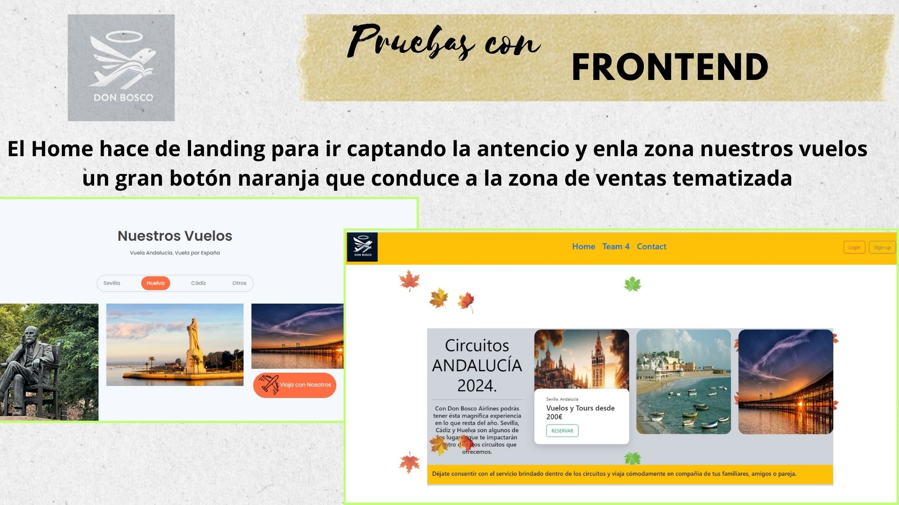

# DonboscoApp Airline


## Team members (Team 4)
* **Ana Maria Martin** [GitHub](https://github.com/anamartin99)
* **Isamar Romero Bellorin** [GitHub](https://github.com/IsamarRB)
* **Abraham Martin Moya** [GitHub](https://github.com/abmmm19888)
* **Raunier Limonta** [GitHub](https://github.com/Raunier24)
* **Jose M. Alonso Tirado** [GitHub](https://github.com/jmatisam)

## Documentation


*  [Canva Documentation](https://www.canva.com/design/DAGRRwTYhYo/pbsLMFyFdP_47cmAtT1z3Q/view?utm_content=DAGRRwTYhYo&utm_campaign=designshare&utm_medium=link&utm_source=editor)

---

## Table of Contents
1. [Project Description](#project-description)
2. [Project Objectives](#project-objectives)
3. [Functional Requirements](#functional-requirements)
4. [Non-functional requirements](#non-functional-requirements)
5. [Technical Details](#technical-details)
6. [Diagrams and Management](#diagrams-and-management)
7. [Deployment in Docker](#deployment-in-docker)
8. [Monitoring](#monitoring)
9. [Extra Resources](#extra-resources)
10. [Contribution Guide](#contribution-guide)
11. [Copyright and License](#copyright-and-license)

## Project Description

The **DonboscoApp Airlines** project is an integrated management system for an airline, designed with a monolithic architecture on Spring Boot. This system facilitates the administration of users, flights, reservations and destinations, and has advanced functionalities such as secure authentication through JWT and automatic administration of flights and seat availability. Everything is implemented in **Java 17**, **Maven** and **MySQL**.

---

## Project Objectives

1. **Strengthen** knowledge in RESTful API creation.
2. **Implement** database relationships for efficient modelling.
3. **Manage** real-time data concurrency.
4. **Configure** secure authentication with Spring Security and JWT.
5. **Automate** integration and deployment testing with GitHub Actions.

---

## Functional Requirements

### User Management
- User registration, authentication and roles (ROLE_ADMIN and ROLE_USER).
- Generation and validation of JWT tokens for secure sessions.

### Flight Management
- Automatic generation of flights in database at compilation time.
- Change of status from ‘available’ to ‘unavailable’ for flights without seats or out of date.

### Booking Management
- Creation of reservations only if there is availability and valid route.
- Check availability of seats before confirming reservations.

### Flight Destination Management
- CRUD of destinations associated to flights (accessible only for ROLE_ADMIN).

### Consultation and Management of Users
- Complete CRUD (management exclusively for ROLE_ADMIN).
- Consultation of booking history for each user (ROLE_USER).

### Exception Management
- Custom exception handling for a consistent user experience.

---

## Non-functional Requirements

- **Security**: Implementation of Spring Security and JWT for API protection.
- **Performance**: Optimisation of automatic flight status and booking management.
- **Scalability**: Monolithic design adaptable to microservices architecture in the future.
- **Availability**: Unit and integration tests to guarantee stability in production.
- **Normative**: No use of Lombok, ensuring code clarity.

  ## Frontend

 

  ## Pruebas Frontend
 


### Presentation
- Summary of the project in Canva: [View presentation](https://www.canva.com/design/DAGSO3gUpJk/bfFAwv5H2VinnjPdHvmzkQ/view?utm_content=DAGSO3gUpJk&utm_campaign=designshare&utm_medium=link&utm_source=editor)

---

## Diagrams and Management

- **Pseudocode and Flowcharting**: Detailed planning and structure in Miro. [Access to Miro](https://miro.com/app/board/uXjVLcwbrA4=/)
- **Project Management**: Task organisation and progress tracking in Trello. [Kanban in Trello](https://trello.com/b/8bGEV7eY/db-aerolinea)

---

## Monitoring

- Integration of monitoring tools in Docker for performance analysis.


---

## Extra Resources

### Backend
- (https://github.com/jmatisam/DonboscoApp)
  
 

---

## Contribution Guide

### Cloning the Repository
1. Open your terminal.
2. Clone the repository:

   ```bash
   git clone https://github.com/jmatisam/DonBosco_Airlines.git
   cd DonBosco_Airlines

### Contributing to the main project
1. Make a fork of the repository on GitHub.
   ```bash
   git clone https://github.com/tu-usuario/DonBosco_Airlines.git
   git checkout -b nombre-de-tu-rama

2. Make your changes and commit your commits.
3. Upload your changes to your fork and open a pull request on the main repository.

## Recommendations
* Be sure to follow the project structure and maintain code formatting.
* Include detailed descriptions in your commits.
* Verify that all tests pass before submitting a pull request.

---
## Copyright and License
This project, DonboscoApp Airlines, is owned by Team 4 and was developed as part of the final project of the Don Bosco Foundation & F5 Factory P1-Backend & DevOps bootcamp. All copyrights belong to the team members, and the use of this software is restricted to educational and evaluative purposes. No distribution or commercial use is permitted without the explicit consent of the owners.

* License: This project is licensed under the MIT License. For more information, see the LICENSE file.
---
# TEAM 4

